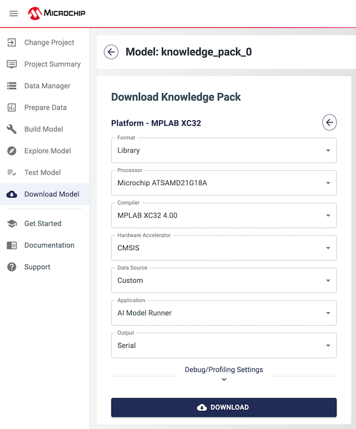
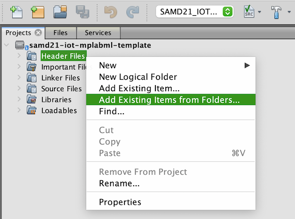

# Template MPLAB® X IDE Project for MPLAB ML Development Suite

# Overview
This repository contains an MPLAB X project that can be used as a starting point for running any MPLAB ML Knowledge Pack on the SAMD21 Machine Learning Evaluation Kit ([BMI160](https://www.microchip.com/developmenttools/ProductDetails/EV45Y33A) or [ICM42688](https://www.microchip.com/DevelopmentTools/ProductDetails/PartNO/EV18H79A) variant). Read on for instructions on how to go from a Knowledge Pack deployment to a full working MPLAB X project.

|  |
| :--: |
| *Microchip SAMD21 Machine Learning Evaluation Kits* |

## Hardware Used
* SAMD21 Machine Learning Evaluation Kit with Bosch BMI160 IMU ([EV45Y33A](https://www.microchip.com/developmenttools/ProductDetails/EV45Y33A))
* SAMD21 Machine Learning Evaluation Kit with TDK ICM42688 IMU ([EV18H79A](https://www.microchip.com/developmenttools/ProductDetails/EV18H79A))

## Software Used
* [MPLAB® X IDE](https://microchip.com/mplab/mplab-x-ide)
* [MPLAB® XC32 Compiler](https://microchip.com/mplab/compilers)
* [MPLAB® Harmony 3](https://www.microchip.com/harmony)
* [MPLAB® ML Model Builder](https://onlinedocs.microchip.com/v2/keyword-lookup?keyword=MPLAB-ML-Documentation&redirect=true)

## Related Documentation
* ATSAMD21G18 [Product Family Page](https://www.microchip.com/wwwproducts/en/ATSAMD21G18)
* SAM-IoT WG Development Board [Product Details](https://www.microchip.com/developmenttools/ProductDetails/EV75S95A)
* MikroElektronika IMU Click Boards
   * [6DOF IMU 2 Click](https://www.mikroe.com/6dof-imu-2-click)
   * [6DOF IMU 14 Click](https://www.mikroe.com/6dof-imu-14-click)

# Knowledge Pack Deployment
To deploy a knowledge pack for the SAMD21 ML Eval Kit:

1. Open up your project in the ML Model Builder and navigate to the *Download Model* tab.
2. Select the XC32 Compiler option.
3. Select `Library` or `Source` from the *Format* options. *Note: source format is only available for upper tier customers*.
4. Select `Microchip ATSAMD21G18A` from the *Processor* option.
5. Click the *Download* button to download the model.

   |  |
   | :--: |
   | Deployment from the ML Model Builder |

# Knowledge Pack Integration
After downloading the knowledge pack, the contents need to be added to the template MPLAB X project (`samd21-iot-mplabml-template.X`). Follow the steps below to integrate the knowledge pack into an MPLAB X project.

1. Extract the contents of the downloaded .zip file.
2. Create a new folder named `knowledgepack` in the `firmware` folder of the template project (`ml-samd21-iot-mplabml-template-main/firmware/knowledgepack`) and copy the `knowledgepack_project` and `mplabml` folders from the downloaded .zip into that new folder.
3. In MPLAB X, open up the .X project folder within the `firmware` folder of the this repository.
4. Select the *Project Configuration* option in the MPLAB X toolbar according to which sensor you're using.
   |  |
   | :--: |
   | Set the Project Configuration according to sensor |
5. In the *Projects* pane, right click the *Header Files* folder under the template project and select *Add Existing Items from Folders* from the options.
   |  |
   | :--: |
   | Adding knowledge pack header files to your project |
6. In the resulting window that opens, click the *Add Folder* button.
7. In the new dialog, select *Header Files* from the *Files of Type* dropdown, then navigate to the template project's `firmware` directory and select the `knowledgepack` directory. Click the *Select* button to add the directory.
   |  |
   | :--: |
   | Recursively add header files (.h) under the `knowledgepack` folder |
8. Back in the *Add Files* window, click the *Add* button to finish adding the necessary header files and close the dialog.
9. Right click the *Source Files* folder in the *Projects* pane and select *Add Existing Items from Folders* from the menu.
10. Repeat steps 6-8 to add all source files (.c files) from the `knowledgepack` folder

## Source Format
If you deployed a knowledge pack in the *Source* format, the Knowledge Pack is now integrated into your MPLAB X project. You should be able to compile your project and flash it onto the SAMD21.

## Library Format
If you deployed a knowledge pack in the *Library* format, follow the remaining steps below to link the library into your project:

11. In the *Projects* pane, right click on the *Libraries* folder under the template project and select *Add Library/Object File*.
12. In the resulting window that opens, select the `libmplabml.a` file from the `firmware/knowledgepack/mplabml/lib` directory.

Your project should now be ready to compile.

# Firmware Operation
The firmware behavior can be summarized as operating in one of three distinct states as reflected by the onboard LEDs and described in the table below:

| State |	LED Behavior |	Description |
| --- | --- | --- |
| Error |	Red (ERROR) LED lit |	Fatal error. (Do you have the correct sensor plugged in?). |
| Buffer Overflow |	Yellow (DATA) and Red (ERROR) LED lit for 5 seconds	| Processing is not able to keep up with real-time; data buffer has been reset. |
| Running | Yellow (DATA) LED flashing slowly |	Firmware is running normally. |

When operating normally, the firmware prints the classification prediction (classification ID number) and the generated feature vector for each sample window over the UART port. To read the UART port use a terminal emulator of your choice (e.g., MPLAB Data Visualizer's integrated terminal tool) with the following settings:

- Baudrate 115200
- Data bits 8
- Stop bits 1
- Parity None

A sample of the terminal output is shown in the figure below.

|  |
| :--: |
| UART Terminal Output |

Note that by default the feature vector will not be output. You can enable this behavior by setting `write_features=1` in `sml_output.c`.